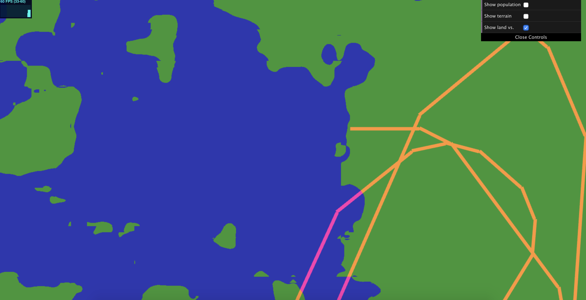

# hw05-road-generation

## The Red Brick Road

## WENDY SUN (wentings) 
- Demo: https://wentings.github.io/hw05-road-generation/
- 

## References
- [Procedural Modeling of Cities](proceduralCityGeneration.pdf)
- Line Intersection: CIS 460 lectures slides
- Noise functions: Previous homework 1 code

## 2D Maps
I generated terrains using an fbm function that calculates the elevation of the land. The two possible views for looking at terrain elevation and simply land vs. water 
are colored appropriately using the height calculated. I generated the population density map using perlin noise, and I checked if the position is on land. If it's in the water or its height is 
below 0.35, the population density is automatically set to 0.
  
## New Pseudo L-System Classes
I mostly revised the L-system classes from the past homework. This time, I started the seed in a random position on the plane. The 
turtle generates a path in its wake. The branching uses instance rendering to create a pseudo L-system that keeps track of the state of
the turtle as it branches. The highway do branch on top of water, which is something I would like to change in the future. 

## Future Improvement
Currently the L-system definitely does not function like it should - it doesn't branch based on its local environment or the data
generated by the texture, and I have yet to successfully populate the smaller streets that are self sensitive and snaps to the highway.

## Tunable GUI Parameters
- Road Thickness
- Land to Water ratio (drag to have more water)
- Population density (drag to make the population more dense)

